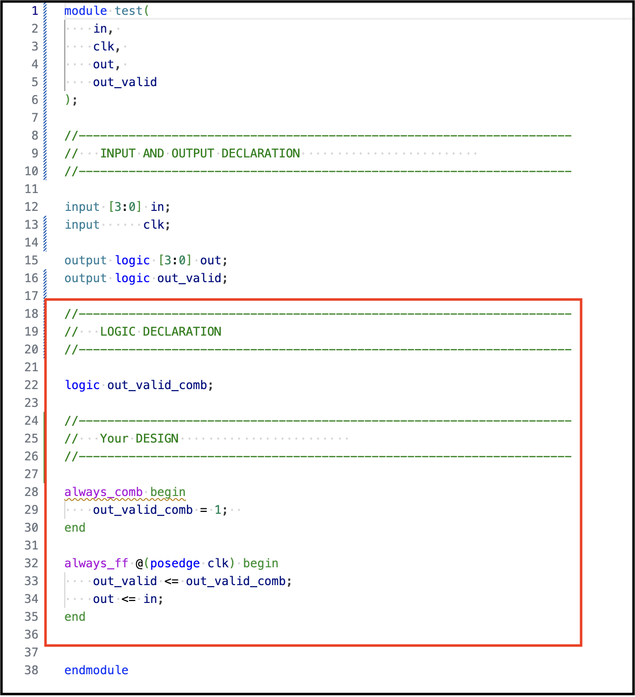
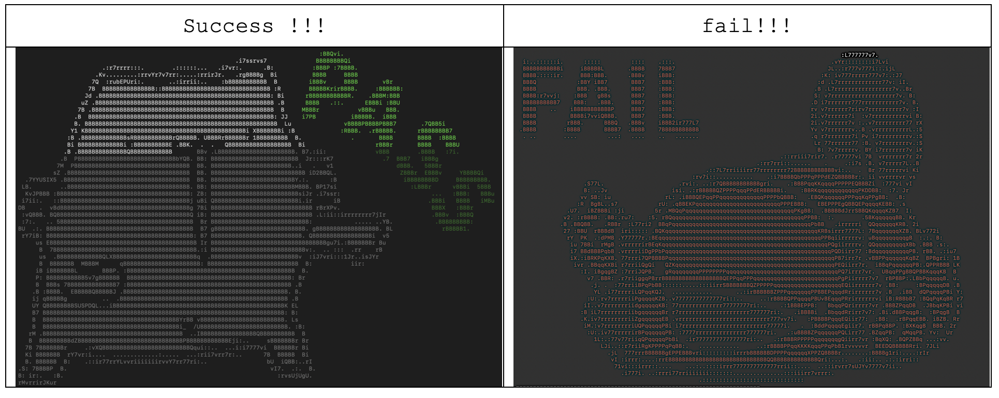

# 數電考古使用說明


</br>

## 零、作者的幹話
#### **獻給即將慘遭數電荼毒的各位～**
相信即使前方道路部滿荊棘，大家肯定還是勇往直前的吧
在面對未來的迷莽，心裡還是會激起一絲恐慌，想為此準備什麼但卻毫無頭緒
別擔心，如今我們將我們慘痛的經歷幻化為北極星
雖然不如燈塔來的明亮，但有望能在起步中引領各位，讓各位能夠順利啟航，至少能在各位進入深淵之前，還能感受verilog片刻的美好。


> * **請各位低調的傳承和使用，請勿丟到公開平台**
> * **在旁觀看大神如果我有東西寫錯或是可以補充的歡迎提出～**


</br>


## 壹、軟體安裝

#### 編譯器使用
使用免費版的```iverilog```，雖然處理能力有限，但可供一定程度練習使用，下載請自行查閱網站

> [!WARNING] **註：** 除了Lab以外，其餘的iverilog無法執行處理 (只有Lab能跑模擬)


#### 波形模擬軟體
* **gtkwave:** [介紹](http://programmermagazine.github.io/201311/htm/message2.html)、[下載](https://gtkwave.sourceforge.net)
* **WaveTrace:** VSCode 內建軟體


</br>


## 貳、檔案介紹

<details><summary><b>檔案路徑</b></summary>

```shell!
> DCS_2024
    > Env_test   # Enviroment test (DO NOT MODIFY)
    > PPTs
    > Lab
    > FP
    > HW
```
</details>


<details><summary><b>Lab內部路徑</b></summary>

```shell!
> Env_test/Test_Code

    > 00_TESTBED     --------------> TestBench
        PATTERN.sv
        TESTBED.sv

    > 01_RTL
        01_run.sh    --------------> shell for Mac/Linux
        01_run.bat   --------------> shell for Windows
        test.sv      --------------> Main Design file

    > 02_REPORT
        run.vvp
        syn.log
        WAVEFORM.vcd --------------> Waveform file
```
</details>

</br>


## 參、實戰練習方法

* **Step 1:** 把紅色框框的部分改成自己的code



* **Step 2:** 於 ```Terminal/cmd``` 中，進入該Lab的資料夾 ```01_RTL``` 裡

```python!
    allen@Allens-Mac DCS_2024 % cd Env_test/Test_Code/01_RTL 
    allen@Allens-Mac 01_RTL %
```


* **Step 3:** 打上以下指令

```python!
    allen@Allens-Mac 01_RTL % ./01_run.sh      # for Mac/Linux
    allen@Allens-Mac 01_RTL % .\01_run.bat     # for Windows
```

* **Step 4:** 結果顯示



</br>


# 數電貓貓祝各位修課順利 !!!
* **上手指南** [hackmd link here](https://hackmd.io/@macplanck/verilog-basic)
* **考古連結** [github link here](https://github.com/macplanck/DCS_2024)


